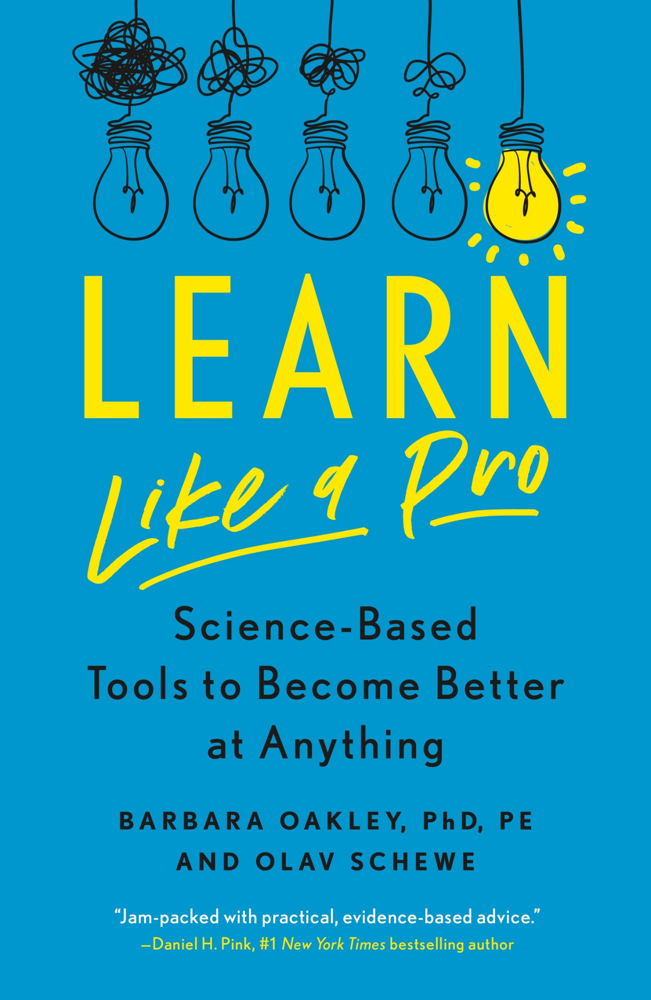
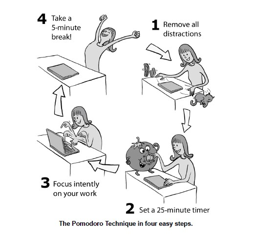
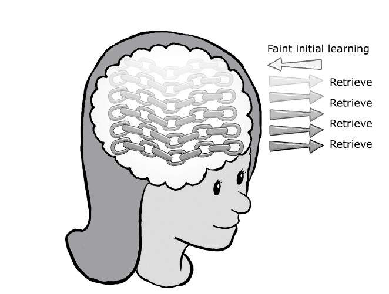
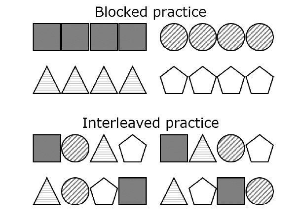
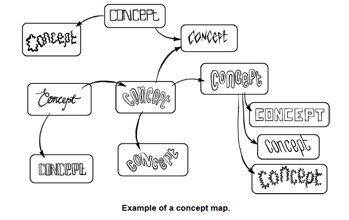

# Learn like a pro.

# Author

**DR. Barbara OAKLEY AND OLAV SCHEWE**

## Table of Contents

 - [Begin Reading](#begin-reading)
 - [How to Focus Intently and Beat Procrastination](#How-to-focus-intently-and-beat-procrastination)
     - [The Pomodoro Technique](#the-pomodoro-technique)
     - [Why the Pomodoro Technique Works](#Why-the-Pomodoro-Technique-Works)
     - [Avoid Your Mobile Phone During Learning breaks](#Avoid-Your-Mobile-Phone-During-Learning-breaks)
     - [Be Wary of Multitasking When Studying](#Be-Wary-of-Multitasking-When-Studying)
     - [Set Up a Distraction-Free Environment](#Set-Up-a-Distraction-Free-Environment)
 - [How to Overcome Being Stuck](#How-to-Overcome-Being-Stuck)
 - [How to Learn Anything Deeply](#How-to-Learn-Anything-Deeply)
   - [When You Learn, You Create Links](#When-you-learn-you-create-links)
   - [Study Actively, Not Passively](#Study-Actively-Not-Passively)
   - [Challenge Yourself So You Can Advance More Quickly](#Challenge-Yourself-So-You-Can-Advance-More-Quickly)
   - [How to deepen Your Learning](#How-to-deepen-your-learning)
 - [How to Maximize Working Memory and Take Better Notes](#How-to-Maximize-Working-Memory-and-Take-Better-Notes)
   - [Working Memory  Master trickster](#Working-Memory-Master-trickster)
   - [Sets of Links in Long-Term Memory Enhance Your Working Memory](#Sets-of-Links-in-Long-Term-Memory-Enhance-Your-Working-Memory)
   - [Making the Best Use of Your Working Memory](#Making-the-Best-Use-of-Your-Working-Memory)
   -[How to Take Better Notes](#How-to-Take-Better-Notes)
 - [How to Memorize](#howtomemorize)
 - [How to Gain Intuition and Think Fast](#wowtogainintuitionandthinkfast)  
 - [How to Exert Self-Discipline Even When You Don’t Have Any](#howtoexertself-disciplineevenwhenyoudon'thaveany)
 - [How to Motivate Yourself](#howtomotivateyourself)
 - [How to Read Effectively](#howtohreadeffectively)
 - [How to Win Big on Tests](#howtowinbigontests)
 - [How to Be a Pro Learner](#howtobeaprolearner)

# Begin Reading

1. Do you spend to much time learning with disappointing results?
2. Do you find it difficult to remember what you read?
3. Do you put off studying because it's boring and you're easily distracted?

Building on insights from neuroscience and cognitive psychology, we will give you a crash course to improve your ability to learn, whether you’re studying math, language, coding, karate, cooking, or anything else.

Through their decades of writing, teaching, and research on learning, Olav and Barb have developed deep connections with experts from a vast array of disciplines. What you’ll find in this little
book are the very best of practical learning tools and insights synthesized from research in neuroscience, cognitive psychology,education, and many other fields.

# How to Focus Intently and Beat Procrastination

# The Pomodoro Technique
  
  - Use this approach to structure your study sessions:

  1. **Sit down where you’ll be studying or working and remove any possible distractors.** This means ensuring there are no pop-ups or extraneous open tabs on your computer, dings from your cell phone, or anything else that could draw you off-task.

  2. **Set a timer for 25 minutes.** You can use a mechanical or silent digital timer. You can also use the timer or an app on your phone. If you use your phone, place it out of sight and beyond arm’s reach so you won’t be distracted while focusing.

  3. **Dive in and study or work as intently as you can for those 25 minutes.** If your mind wanders (as it inevitably will), just bring your attention back to the task at hand. Most things can wait or be postponed for 25 minutes. If distracting thoughts come up that you feel like you should act on, write them down in a to-do list so you can tackle them after the Pomodoro session is over. 

  4. **Reward yourself** for about 5 minutes at the end of the Pomodoro session. Listen to your favorite song, close your
     eyes and relax, go for a walk, make a cup of tea, cuddle with your dog or cat—anything to let your mind comfortably flow free. It’s also best to avoid checking your cell phone or email during this break time—more on why later.

  5. **Repeat as appropriate.** If you want to study for 2 hours, you can do four Pomodoros with the break lasting roughly 5 minutes each time. If you have trouble getting yourself back to work when the break is done, set a timer for the break as well.

  

  
  The Pomodoro technique in four easy steps. 

## Why the Pomodoro Technique Works
 
 You might wonder how something so simple can be so powerful. The reason is that the Pomodoro Technique captures important aspects
of how your brain learns.
  
  * Pomodoro-fueled bursts of focused attention give your brain practice in focusing without disruption. 
  * Short mental breaks where you get away from focusing are ideal to allow you to transfer what you've just learned into long-term memory, clearing your mind for new learning.
  * Anticipation of a reward keeps you motivated throughout the Pomodoro.
  * It's much easier to commit and recommit yourself to short bursts of dedicated study than to seemingly endless sessions.
  * Your studies begin a pattern of focusing on the _process_ putting in certain amounts of dedicated time rather than the _goal_ or _outcome_.
  
   Note:_In the long run, having a good process in place is much more important than any one individual session or goal.
  * When you even just think about something you don’t like or don’t want to do, it activates the insular cortex, causing a “pain in the brain.” This pain diminishes after about 20 minutes of focus on the activity.

## Avoid Your Mobile Phone During Learning breaks

Research by professors Sanghoon Kang and Terri Kurtzberg from Rutgers Business School has revealed that *using a mobile phone for a break does not allow your brain to recharge as effectively as the other types of breaks.*

*Mobile phones are also particularly distracting if you happen to be in face-to-face training of classes*. One study found that _Students who were not using their mobile phones wrote down 62% more information in their notes  where able to recall more detailed information from the lecture, and scored a full letter grade and a half higher on a multiple choice test than students who actively used their mobile phones. Even just having your phone near you while you're studying can be distracting your brain is still tracking it if it knows it's close at hand.
If you feel anxious without a phone, researchers have found you'll still be better of with the phone out of reach. Leave your phone in a backpack, briefcase, or purse, or even back in the car. You'll be shocked at how mucho your focus improves. 

## Be Wary of Multitasking When Studying

Multitasking while you are studying it is not good the reason of that it is because whenever you switch your focus to a new task, you activate information stored in you brain related to the new task. When you switch to a different task we activate a different set of information. This leave you what's call and __attention residue__ some leftover attention from your previous task that means your attention isn't fully on the new task. 

Frequently this increase susceptibility to distraction, causes more errors, slows work, make writing worses, diminishes learning, and causes forgetting. __In short, bad news. One study by researchers at the University of Michigan found that cognitive performance fell by 30-40 percent when participants switched between tasks instead of completing on task before moving to the next. 

## Set Up a Distraction-Free Environment
Some time it might be a little bit difficult but you have to find a place where you can study without any distractions. 

Recommendation
1- Avoid study in rooms where your friends or colleagues socialize. 
2- A quiet library or isolated location can be ideal. 
3- Avoid your cellphone notifications from computer and phone. 

__Create a Ready-Resume Plan When an Unavoidable Interruption Comes up__

_ Take a few seconds to mentally note where you are in your current task, and how you'll return to the task. 

__Take Frequent Brief Breaks__

- Taking mental break will help you to offload the new material into de long-term memory.
- Breaks tha involve something Physical, like going for a walk or jog, are always a good Idea. 
- Another reason is tha movement and exercise themselves are helpful for the learning process. 

__Music and Binaural Beats__

Studying to music may you feel that you can study longer, but because while you listen music, part of your attention is
following the turn so you aren't working as has you could be. If you are getting good grades or evaluations for what you're
learning, you're probably fine to listen to music. But if your feedback isn't what you would like, or you're struggling to make
headway with the material, we'd suggest backing away from music. 

**KEY TAKEAWAYS** 
FROM THE CHAPTER

**The Pomodoro Technique is one of the most powerful methods for tackling procrastination. To do it:**

– Remove distractions.
– Set a timer for 25 minutes.
– Focus as intently as you can for those 25 minutes.
– Reward yourself. Take a 5-minute or so mental break. (Use a timer for the break if necessary.)
– Do another Pomodoro until the work—or you!—is done.

**A pain in the brain can trigger procrastination.** 

Be aware of minor feelings of discomfort when you think about something you don’t like to do—these feelings can trigger procrastination.
That pain in the brain dissipates once you get started.

**In general, it’s best to avoid multitasking.**
 
 But multitasking is not all bad—it can sometimes help you avoid becoming fixed on a cognitive approach that’s going nowhere.

**Set up a distraction-free environment.**

 Do a sweep through the notifications settings on your devices and disable audible, visible, and vibrating alerts. Keep your phone out of reach.

**If you are called off-task by someone or something, try to take mental note of where you were so you can more easily return to it.**

**Take frequent brief breaks.**
 
 If you go too long on any one task, you will inevitably tire.**

**If you like to listen to music when you’re working, make sure it isn’t distracting your attention.** 
 
 Think twice about listening to music while studying unless you’re already learning the material well.

# How to Overcome Being Stuck

In this chapter you going to find a few tips that going to help you to overcome being stuck while you are studying. 

The Author point out at the beginning to mode that can help you.

**Focused Mode** helps you work through familiar problems, to load difficult material into your brain so the diffuse mode can begin
processing it.

**Diffuse Mode** helps you make sense of new challenges in whatever you're learning, whether it's understanding a new accounting concept, handling a challenging search engine optimization problem, or figuring out how to put in windy conditions in golf. 

**Learning often involves moving back and forth between focused and diffuse modes.** It's typical to get stuck when learning something difficult that just means it's time to move from focused to diffuse mode. Take a break, o work on something different, to let neural processing continue in the background. 

**Use the Hard Start Technique.** This means to begin with the hardest problems on the tests or homework. Pause the hard problem when you get stuck so that you can work on another problem. Return the hard problem after a while. 

**Do not edit when you're writing the first draft of a report or essay.** A good way to avoid editing is to cover or turn off your computer screen so you can't see what you're writing 

# How to Learn Anything Deeply

Definitions 

1- Synapse: The connection point between two neurons.  
## When You Learn, You Create Links
 Whenever you learn something, you're simply connecting neurons a basic _"Building block"_ cell in the brain. 

 
   >The more you practice, the thicker and stronger the neural connections become. Learning more complex information well also creates longer sets of links you can see how a small piece of information has only a short set of links, symbolized by the three links at the top, while more complicated information creates longer and longer sets of links. As you learn more, you also discover the connections and differences between different concepts these are shown by the light set of links connecting the main "concept" links.The more set of links and connecting links that you create through understanding and practice, the more expert you become. Of course, in real life, learning involves many more neurons and links.
## Study Actively, Not Passively
   When you're learning, it's is important to study _Actively_, making your brain work hard or think hard. 
   *Do*
   * Active work the problem yourself.
   * Try to remember the main points from a video you just watched or a book section you've just read. 
   *Don't*
   Don't just look at the problem solution. 

   Passive reading in the other hand, such as effortless listening or reading, isn't  very effective. 

    **About Retrieval Practice**
  It is about pulling information from you own memory, or work with you own mind, rather than simply looking at the material. The more you retrieve the material, and the broader the set of contexts you retrieve the materials in, the stronger and more broadly connected the neural links become. 

  **Key point**
  The best way to put information _into_ your long-term memory is to try to retrieve it from your own long-term memory instead of just looking at the answer. 
 
  
  >When you first learn something, it places a faint trace in your sets of links. The more you retrieve those set of links, the more you strengthen them. 

Sentences.

**1. The more you practice, the thicker and stronger the neural connections become.** 
**2. At the heart of active learning lies something called "retrieval practice."**
**3. Retrieval practice is therefore also a _metacognitive strategy_ that helps you evaluate your own learning.** 

## General Techniques for Learning Actively
Here are some techniques that will help you approach your learning in an active way.
* Work out example problems yourself, without looking at the solutions. (If you have to peek partway through, after you finish
  the problem, go back and do the whole problem again.)
* Try to recall the key points from a book, article, or paper. Look away and see if you can recall the key idea or ideas. If what
  you’re reading is difficult, it’s best to pause and try to recall after each page of what you’re reading.
* Formulate your own questions about the material.
* Take practice tests, preferably under time pressure that simulates the actual time constraints of the test.
* Find ways to re-explain key ideas from your notes or textbook in simpler terms, as if you’re explaining them to a child.
* Work with others, either another person or a small group—meet and discuss the concepts, give mini-lectures, and compare approaches.
* Create flashcards, either by hand or using an app, such as Anki or Quizlet.
* Explain your thinking out loud to another person, or teach the key concepts to someone else.
* Ask a partner to quiz you. (The stress of being quizzed in front of a friend can mimic some of the stress of an actual quiz or test.)
* Take a practice test, even if you haven’t studied much yet. (Guessing answers on practice questions has been shown to improve subsequent learning.)
* Make your own practice test.
* Try to remember key points when you’re doing mundane activities such as washing the dishes or going for a walk.

## Challenge Yourself So you Can Advance More Quickly 

If you want to advance quickly in your learning, you need to continue forming new connections in long-term memory, and not just reinforce the connections you've already made. This means it's important to keep pushing yourself every day with harder material. 

## How to Deepen your learning 

**Elaboration**
 1. You can broaden{mean to expand} your set of links by actively thinking about what you're learning, as well as by writing and talking
    about it. 
     * A technique called self-explaining or elaboration can help. With this technique, you actively try to explain, in you own words, what you're learning. When working on numerical problems, for example, stop at every step and ask the question "Why am I doing this step?" and try to come up with an explanation. 
     * For Concept that you're reading about, try to explain them as if you were teaching. Make your explanations different from the one you've just read. Try to simplify, improve, and provide examples. 
**Interleaving**
 
 Interleaving means varying or mixing different concepts. 

  Using this technique give you the chance to contrast the different style between one author an another. At the beginning you have to work through the feelings of frustration, and you'll find yourself learning much faster. 

  

  **Beware of procrastination**
     Procrastination may be useful when in terms of complete a tasks refer. but when it come to learn it doesn't help a lot because multiple reason.
     1. It takes brief periods of study each day over a number of days to grow a solid neural architecture of learning. 
     2. If you procrastinate with something you're try to learn, you're undercutting your ability to make progress.
     3. Give your brain the time it needs to learn a new subject. 

**KEY TAKEAWAYS** 
FROM THE CHAPTER
**-Learning means connecting neurons in your brain. To make learning deep and lasting, you have to make those connections strong.**
**-Actively engage with the material to jump-start those neural connections, using retrieval practice whenever is possible**:
 - Work problems yourself avoid looking at the solutions
 - Test yourself 
 - Try to recall main ideas from a text.
 - Explain key concepts in simple ways to yourself, or to someone else.
 - Work with another person or small group of that is as interested as you are in the material. 
 - Create study materials flash cards, study guides, anything that require you to process the information and put it into a new format.
 **-Break up your learning int several shorter sessions over several days, instead of one ultra long session.**
 **Challenge yourself to progress faster**.  When learning becomes easy, increase the level of difficulty.
 **To learn difficult concept well, you need to actively connect what you're learning to other material you're learning or already know.** You can do this through elaboration or interleaving. 
 **Don't procrastinate when you're trying to learn it takes may days to build the solid neural architecture of good learning.**
 **Exercise regularly.** Exercise has been shown to help you more easily form neural connections.
 **Cautions use of cognitive enhancements such as coffee or tea, along with a healthy diet, can improve your ability to learn.**
 **Regularly get enough sleep**. Sleep is when your neural architecture grows. Spacing out your learning over several days will give more sleep periods, which will strengthen your learning. \

Retrieval Practice:
 One of the best way of put information in your long term memory is to try to __retrieve__ it from your own long-term memory instead
  of just looking at the answer. 
  Links read about retrieval practices:
   [Retrieval and sleep both counteract the forgetting of spatial information](https://www.ncbi.nlm.nih.gov/pmc/articles/PMC5959224/)\
   [Retrieval-Based Learning: Active Retrieval Promotes Meaningful Learning](https://journals.sagepub.com/doi/10.1177/0963721412443552)
 # How to Maximize Working Memory and Take Better Notes

  **KEY POINT**
   The brain has two separate types of memory: _working memory_, which only holds information temporarily, and _long-term memory_ which is more permanent. True learning only takes place when information has been moved from working memory into long-term memory. 

 ## Working Memory Master trickster 

 Your Working memory normally can hold about three or four concepts. 

>Your working memory can only hold up to about four pieces of information in mind at once. If it gets too many thoughts, it become overwhelmed. Information and thoughts can fall out. 

## Sets of Links in Long-Term Memory Enhance Your Working Memory

You can effectively hold more in working memory at one time, since each one of the octopus's four arms can grab a piece of information tha you've already learned. 

## Making the Best Use of Your Working Memory

If you struggle to understand the material, it's likely because your working memory is overwhelmed it can not handle all that difficult information at once. Here's what you should do:

**Simplify**

* As you study books and articles, try to synthesize the key ideas, which are often surprisingly simple.

**Break Material into Chunks**
* Find a way to break your learning down into smaller chunks. Try to focus on the fundamentals.

**Translate into More Understandable Terms**
Try to attach what you're learning to something you already know or are familiar with.

**Make a List**
Instead of trying to remember dozen of more tasks, the only thing you need to remember it that you have a task list. 

**Put something on paper**
You must put a key word, number, or formula onr paper extends your working memory to the paper. Storing such information temporarily
on paper instead of in working memory frees up capacity hta can be used for other thoughts.

## How to Take Better Notes

**Prepare**

If you're taking notes from a class lecture, you should read through or at least scan any associated material or assigned readings ahead of time. If you're watching a video, subtitles are sometimes available as a document you can glance through ahead of time. Such preparation will give you a structure that will help you make better and more organized notes. 

**Extract and Organize the Essence**

- Split Notes

> Example of split notes: Notes are written down in the right field and are later supplemented by summarizing key words or heading on the left. 
Dos:
- Make a vertical line one-third of the way across the page. 
- Try to capture the main ideas (not the word-for-word verbiage) in the space to the right of the vertical line. 
= Use contractions
- Use Symbols, abbreviations. 
- Put summarizing words or brief phrases int he left column. 

Don't
- Omit tiny words your brain would fill in(the,a, like, thus).

Later, when you review your notes, cover up the right-hand side and quiz yourself to see whether you can recall the deeper meaning from the summary words. 

**If something seems particularly important, or involves material that might be on the test, put a start next to it.**

- Concept Mapping 

Concept mapping is an approach to organizing information to see how ideas and concepts relate to one another. 

- Review 

The most important thing you can do with your notes is to *review them again before the end of the they*. Even if you're tired, spend a few minutes to pull the key ideas bak into your mind(don't just skim over the notes.)
* A good review session including retrieval practice can be extraordinarily helpful in building those all-important set of links. This review can actually be more valuable than the note-taking itself. 

**Above all, remember that it's not the note-taking it's what you get into your brain that matters** Event the best note are worthless if they're not used as the study tools they were meant to be. 

- Partnering in Note-Taking

Taking notes is important because it helps you stay focused, especially if you're in a class or workshop. 

**KEY TAKEAWAYS** 
FROM THE CHAPTER
- **Working memory is oly a temporary holding place for thoughts and information.** When you put something in working memory, it can seem as if you've truly learned it. But learning only happens when you secure the idea, concept, or technique in long-term memory. 

- **You can typically hold perhaps four pieces of information in your mind at once,** because your working memory has only a few "arms."

- **You can compensate for the small size of your working memory by building sets of links in long-term memory.**

- **You can compensate for the small size of your working memory by building sets of links in long-term memory.**

- **To make the best use of your limited working memory:**
 - Break material into chunks.
 - Translate what you're leaning into more understandable terms.
 - Make a task list to clear your working memory. 
 - Put ideas on paper to extend your working memory.
- **To take good notes:**
 - Use the split notes system or make a concept map.
 - Do a first-time review of your notes the same day you take them.
 - Make sure you actively practice with and try to recall the key ideas of the notes.
 