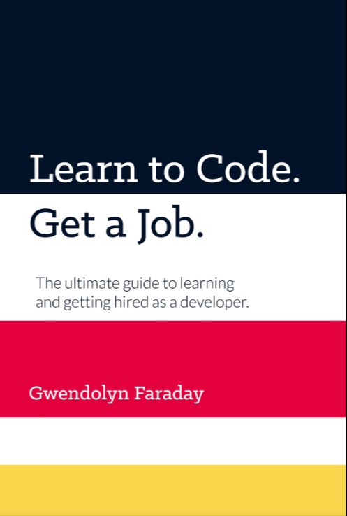

# Learn to Code. Get a Job.

# Author

**Gwendolyn Faraday**

## Table of Contents

- [Introduction](#introduction)

- [Chapter 1](#chapter1)
  - Information & Planning

Introduction

The journey to become a programmer could be overwhelming for someone who is starting now. There are many question to answer that many people waste time to just studying up and learning methods and then giving up in frustration. The idea of this book is to give us a simplified step-by-step approach that you can follow to prepare for a job.

> **What is means to build software?**

- Software is not just about building web-sites.Being able to build quality software means learning the necessary patterns,tools, and frameworks to work collaboratively with professional teams. Having a clear plan, path or goal could give you a clear way to start of building software.

> **How it is organize this book?**

- This book book is divided into five important sections

1. Information & Planning
2. Learning
3. Networking
4. Job Preparation
5. Getting Hired

There are some terminology that you must be familiar with in a way to get in context in this book.

- **Developer,Coder,Programmer and software engineer** is refer to the same person y terms of software development.
- **Meetup** refers to and event where people get together to hear a presentation or discuss a certain topic. Sometimes these events are about software what is owner interesting area.
- **Tech stack** refers to the languages, technologies, and related tools used in specific project or company.
- **Repository**(repo) is a place where the files and folders of a piece of software are hosted online. Storing code in repositories could be helpful in the way of keep a track of your code and also can be share with other software developers.  

# 
**Chapter 1**

## **Information & Planning**  

> ### **RECOMMENDATIONS FOR STARTING**
>
> Because you are going to receive a lot of recommendation from many people on how to begin, all of those options can overwhelming as your careerer as a developer start.The tech industry have many different area where you can steer your career in whatever direction you want.

**First steps**

1. You need to understand the options available to you for software development jobs.
   The field of software development is not just about being a coder, there hundreds of vertical options you can work in ant thousand of ways to specialize in the industry. Keep in mind that all of this jobs and types of companies can be repeat it.
   **Types of Companies**

   - **Tech:** Companies whose primary products are software or hardware applications are called tech companies. Eg.
     - Facebook.
     - Apple.
     - Amazon.
     - Netflix.
   - **Corporations:** Are companies with a least 1000 employees some of the benefit of working at these types of companies are.
     - Have a dedicated budgets for training.
     - Pay larger salaries.
     - Have plenty opportunities to growth.
     - Look great on your resume.
   - **Mid-side:** Are the most stable and conservative option, and have anywhere from 100-1000 employees. One perk of working for a mid-sized company is the flexibility the offer their employees.
   - **Startups & Small companies:** Usually have less than 1000 employees and have only been in business for a few years, making them the most volatile types of companies to work for.
   - **Consulting agencies:** Are companies sometimes small companies that bring professional services of tech. If you work for a consulting agency, your might switch projects every six months to one year and will get to work for many different bosses, reputable consulting companies will let you change project when you start to feel bored or burned out.

     There are two main types of work you will do at a consulting agency:

     1. Staff Augmentation, you'll work with a team of internal employees onsite at a software company, or a company that specializes in another product but has some programmers on staff.
     2. Outsource projects, this will entail working internally with other employees of your consulting agency and is preferable for staff of augmentation because you're working directly for your employer without the middleman.

   - **Types of Developer jobs**
   - **Internal employee**
     - Full time or part-time employment is the most common type of job you will be searching for.
       - Working in a part time you might not be eligible for the same benefit as a full-time employee.
       - Even though these jobs offer a lot of stability, they can become monotonous.
   - **Consultant** are viewed as industry experts with a wealth of experience in a certain profession or industry, but this outlook is not necessarily true anymore.
   - **Contractor** It may be tempting to work for yourself, being a contractor is not for everyone. Contract work can be less stable, and your will have to pay self-employment taxes.

2. You need to choose a specialty; what type of applications you are going to build or ecosystem you want to work in.
   Here an overview to the main type of software development that you might want to work in. This will also give you an idea of keywords that you can look for when researching job postings.
   - **Web Development - Front-End**
   - **Web Development - Back-End**
   - **Full-Stack Development**
   - **User Interface/User Experience (UI/UX)**
   - **Wordpress Development**
   - **Cloud Engineer**
   - **Embedded Systems and Desktop Applications**
   - **Native or Cross-Platform Mobile Development**
   - **Database Administrator**
   - **Quality Assurance(QA)**
   - **Cutting edge industries**
   - **Gaming**
3. You need to choose your a language.
   **Should I Specialize or be a Generalist?**
   - The answer isn't black and white. If your goal is to find a job as quickly as possible, you have to be flexible enough to pick up whatever new technologies and employer might use. On the other hand, if your skill set is too broad, you will not have anything substance to show off in your portfolio and employers might view you as two junior ot be hirable.
   * It is recommended to be **_specialize_** in a language and a few frameworks (one or two) and tools to go along with that language.**_Generalize_** in the ecosystem that you are working in (e.g. web development). Putting this in practice allow you specialize enough to be able to build robust applications in your chosen language and ecosystem. resulting in a more impressive portfolio.
4. You need to create your curriculum.
5. You need to make a study plan.
6. You need to take action.

Those are the steps that is takes to get started on your journey. Later on you can this book talk about everything else networking, building a portfolio, job hunting, etc. Depending on what area you want to be working you would like one more than the other.

**Beginning is Great**

**The Beginning is the most important part of the work**

**Plato, The Republic**

One of the goal of this book is make you hireable as soon a possible. Must of the recommendations of this book is to give you an idea of what you will be facing.

In software development there is a terms that you must know to understand that a software doesn't have to be full complete in order to be useful, Minimum Viable Product(MVP) this allows you to start your product and start growing from there.

What the author mean by this is that you need to start coding as soon as possible! Don't spend too much time researching or learning theory, jump in and learn as you go.
