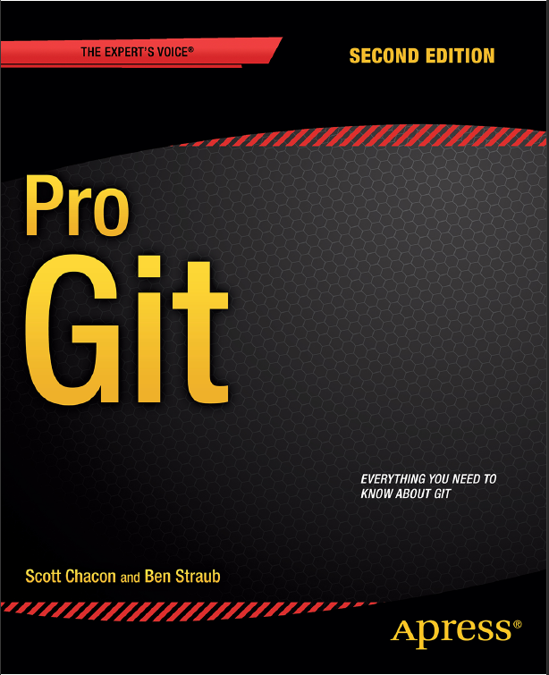
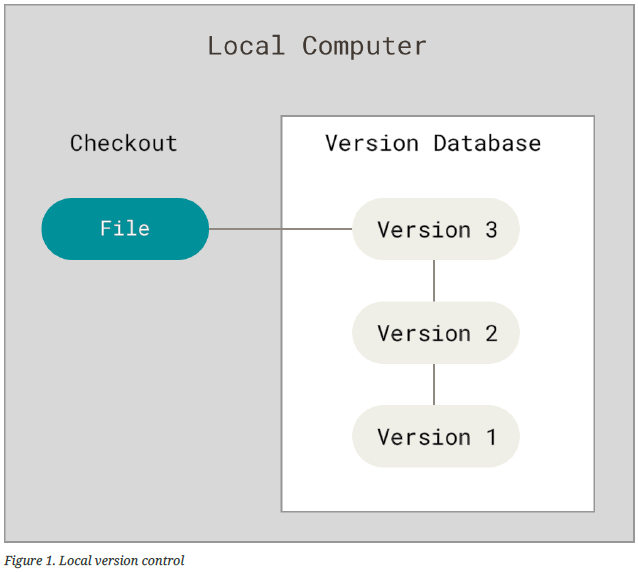
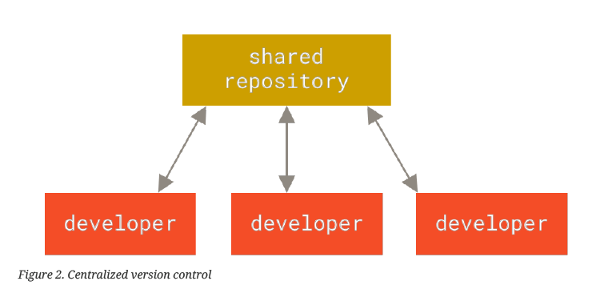

# Pro git

# Author

**Scoot Chacon** and **Ben Straub**

## Table of Contents

- [Introduction](#introduction)

- [About Version Control](#about-version-control)

## Introduction

This part of the book is focus on explaining what is git and explain what is a version control.

What is Git?

Is a version control that take snapshot of the peace of code, Git store and thinks about information in a different way of the other System version of control.

The major different between git and any other VCS is the way Git thinks about its data.

## About version control

- Version control is a system that records changes to a file or set of files over time so tha you can recall specific versions later.

- Version Control System (VCS) is a very wise thing to use. It allow you to revert selected files back to a previous version state, revert the entire project back to a previous state, compare changes over time, see who last modified something that might be causing a problem, who introduced an issue and when, more interesting things.

As a developer we can have a local version control to keep our files versioned but not also that we also can have a centralized Version Control where all of developers can contribute.

Here you can see an example of a local version control and a distributed version control.

I
