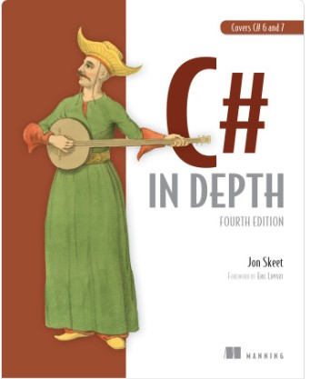

# Learn to Code Get a Job.

# Author

**Jon Skeet**

## Table of Contents

  - [Survival of the sharpest](#Survival-of-the-sharpest)
  - [Information & Planning](#Information-&-Planning)
  - [Learning](#Learning)

   * Being able to run C# in more environments
   * Benefitting from an open and engaged community
   * The book’s focus on old and new C# versions

 **1.1 AN EVOLVING LANGUAGE**

   The thing the author show here is how the feature of the language que catchup in a way that you get involve so you can't opt out. 

**1.1.1. A helpful type system at large and small scales**
  
  C# is a ***statically type language*** meaning that your code specifies the type of the variable, parameter, values returned from a methods, and so on. 

**1.1.2. Ever more concise code**

  In this part of the book you will find some particular feature that the evolution of the language bring to us for example:

  C# 2.0 
        * What type is each item in a sequence so you can communicate more effectively.
        * Also brought nullable types. 

  C# 3.0
      * Introduced anonymous types and implicitly typed local variables (var).

  C# 6.0
      * Introduced *expression-bodied* members that remove more ceremony.
      * String interpolation.
  C# 7.0 
  * gave us the ability to tell the compiler that a user-defined struct should be immutable using *readonly struct* declarations.

  ***Anonymous Methods*** is a method without a name. Anonymous methods in C# can be defined using the delegate keyword and can be assigned to a variable of delegate type.

  **1.1.3. Simple data access with LINQ**

  Support for querying **out-of-process** data is provided via **expression trees**. These represent  code as data, and a LINQ provider can analyze the code to convert it into SQL or other query languages.  

  LINQ didn’t just give C# developers new tools; it encouraged us to think about data transformations in a new way based on functional programming.
  
  **1.1.4. Asynchrony**
   C# 5 brought a new level of clarity to programming asynchrony in a mainstream language with a
feature usually referred to as async/await.

**The feature consists of two complementary parts around async methods:**

* Async methods produce a result representing an asynchronous operation with no effort on the part of the developer. This result type is usually **Task or Task<T>**.

* Async methods use await expressions to consume asynchronous operations. If the method tries to await an operation that hasn’t completed yet, the method pauses asynchronously until the operation completes and then continues.

> blockquote
   ***Note***
   - I could call these asynchronous functions, because anonymous methods and lambda expressions can be asynchronous.

        