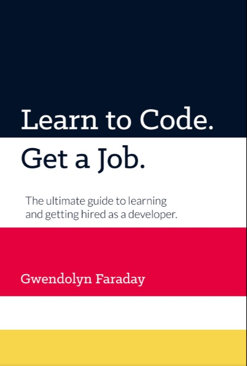

# Learn to Code. Get a Job.

# Author

**Gwendolyn Faraday**

## Table of Contents

- [Introduction](#introduction)

- [Chapter 1](#chapter1)
  - Information & Planning

Introduction

The journey to become a programmer could be overwhelming for someone who is starting now. There are many question to answer that many people waste time to just studying up and learning methods and then giving up in frustration. The idea of this book is to give us a simplified step-by-step approach that you can follow to prepare for a job.

> **What is means to build software?**

- Software is not just about building web-sites.Being able to build quality software means learning the necessary patterns,tools, and frameworks to work collaboratively with professional teams. Having a clear plan, path or goal could give you a clear way to start of building software.

> **How it is organize this book?**

- This book book is divided into five important sections

1. Information & Planning
2. Learning
3. Networking
4. Job Preparation
5. Getting Hired

There are some terminology that you must be familiar with in a way to get in context in this book.

- **Developer,Coder,Programmer and software engineer** is refer to the same person y terms of software development.
- **Meetup** refers to and event where people get together to hear a presentation or discuss a certain topic. Sometimes these events are about software what is owner interesting area.
- **Tech stack** refers to the languages, technologies, and related tools used in specific project or company.
- **Repository**(repo) is a place where the files and folders of a piece of software are hosted online. Storing code in repositories could be helpful in the way of keep a track of your code and also can be share with other software developers.  

# 
**Chapter 1**

## **Information & Planning**  

> ### **RECOMMENDATIONS FOR STARTING**
>
> Because you are going to receive a lot of recommendation from many people on how to begin, all of those options can overwhelming as your careerer as a developer start.The tech industry have many different area where you can steer your career in whatever direction you want.

**First steps**

1. You need to understand the options available to you for software development jobs.
   The field of software development is not just about being a coder, there hundreds of vertical options you can work in ant thousand of ways to specialize in the industry. Keep in mind that all of this jobs and types of companies can be repeat it.

   **Types of Companies**

   - **Tech:**
   - **Corporations:**
   - **Mid-side:**
   - **Startups & Small companies:**
   - **Consulting agencies:**
   - **Types of Developer jobs**
   - **Internal employee**
   - **Consultant**
   - **Contractor**

2. You need to choose a specialty; what type of applications you are going to build or ecosystem you want to work in.
   Here an overview to the main type of software development that you might want to work in. This will also give you an idea of keywords that you can look for when researching job postings.
   - **Web Development - Front-End**
   - **Web Development - Back-End**
   - **Full-Stack Development**
   - **User Interface/User Experience (UI/UX)**
   - **Wordpress Development**
   - **Cloud Engineer**
   - **Embedded Systems and Desktop Applications**
   - **Native or Cross-Platform Mobile Development**
   - **Database Administrator**
   - **Quality Assurance(QA)**
   - **Cutting edge industries**
   - **Gaming**
3. You need to choose your a language.

   **Should I Specialize or be a Generalist?**

   - The answer isn't black and white. If your goal is to find a job as quickly as possible, you have to be flexible enough to pick up whatever new technologies and employer might use. On the other hand, if your skill set is too broad, you will not have anything substance to show off in your portfolio and employers might view you as two junior ot be hirable.

   - It is recommended to be **_specialize_** in a language and a few frameworks (one or two) and tools to go along with that language.**_Generalize_** in the ecosystem that you are working in (e.g. web development). Putting this in practice allow you specialize enough to be able to build robust applications in your chosen language and ecosystem. resulting in a more impressive portfolio.

4. You need to create your curriculum.

   - The main purpose of this part of this is make you hireable as soon as possible, you need to build something to show with you technical skill you don't have to be a master, the best way to show your curriculum is building a portfolio.

5. You need to make a study plan.

   - One of the good things about software is that you don't need a degree to get hire, in this part of the book you going to find some plan that you can follow to prepare you to get a job. All depends on your circumstances and you personality, you have to choose the plan who work for you.

6. You need to take action.

1- Select the pathway that works best for you.
2- Spend some time doing research.

**Terms to learn**

**_Minimum Viable Product(MVP)_**

In software development there is a terms that you must know to understand that a software doesn't have to be full complete in order to be useful, Minimum Viable Product(MVP) this allows you to start your product and start growing from there.

What the author mean by this is that you need to start coding as soon as possible! Don't spend too much time researching or learning theory, jump in and learn as you go.

**Research and Planning**

"If you fail to plan, you are planning to fail." **Benjamin Franklin**

- Step 1:Find Your Why(Knowing _why_ you want to learn programming is the first step.)
- Step 2:Industry Research(Finding the area where you want to work in put you in the way.)
- Step 3:Goal Setting(Set reachable goal, don't put a hard goal.)
- Step 4:Choose a stack(You might think that you need to know everything to start but that is not the reality.)

**Recommendation**

**Learning a New Concept from the author**

1. Tutorial 1
2. Tutorial 2

Practice Concept x

1. Project 1

1. Tutorial 3
1. Tutorial 4

Practice Concept Y

1. Project 1

**Preparation for learning**

1. Define a time to study
2. Take note(Coding involves many complex processes, and without regular review, it is difficult to retain all the concepts )
3. Spaced Repetition Learning( is a technique that incorporates increasing intervals onf time between subsequent review of previously learn material in order to exploit the psychological spacing effects.)
4. Planning Sessions(block everything that can distract you)
5. Study Session(You need to know what you going to study.)

**Tip: Timers and the pomodoro technique**

Mel Robbins,(The Five Second Rule)

**Tip: Avoiding Burnout**

Burnout is when you feel drained and lethargic, like you cannot continue.
